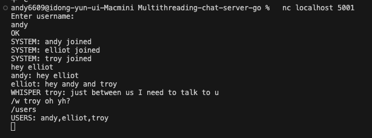
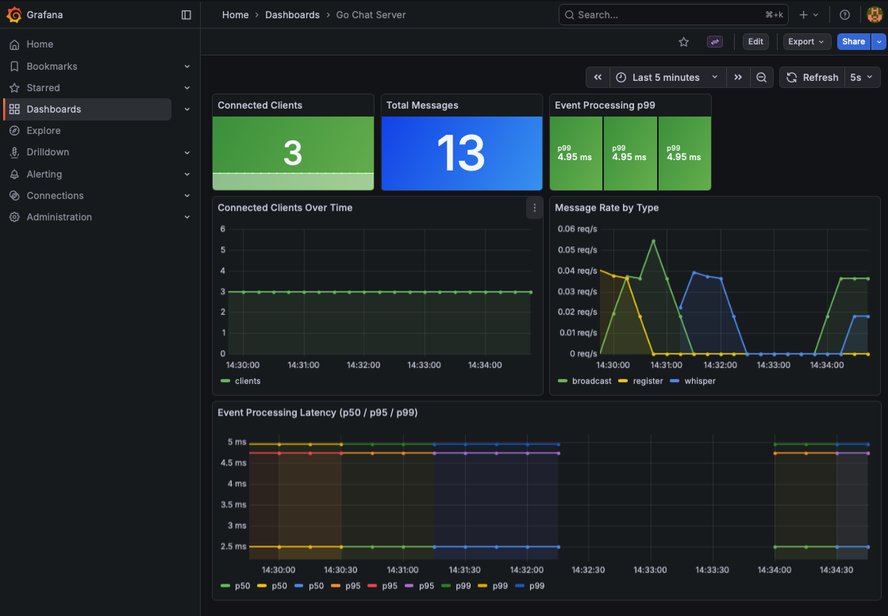
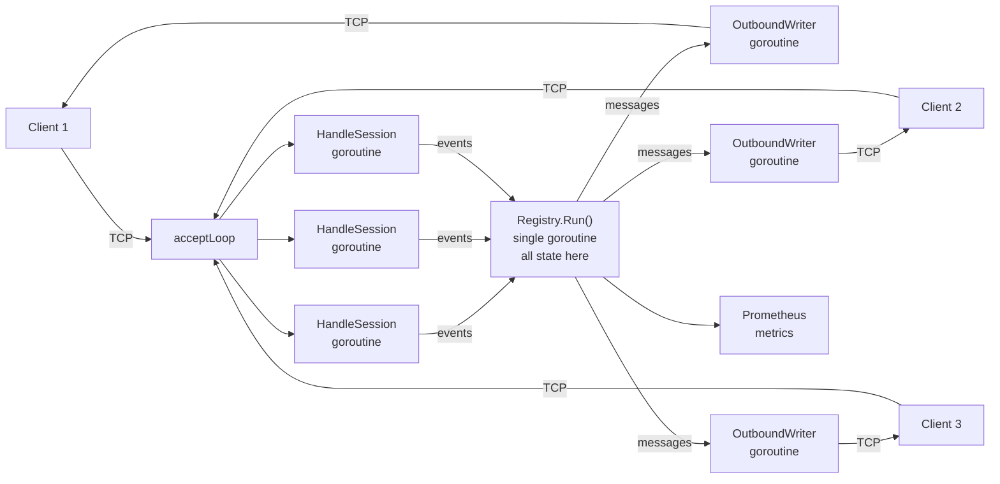

# Go Chat Server

A concurrent TCP chat server, redesigned from scratch in Go after analyzing the structural limitations of a legacy Java implementation.

The original Java system relied on shared mutable state, lock-based synchronization, and thread-per-connection blocking I/O. Rather than patching those issues, I documented the architectural constraints ([legacy analysis](docs/legacy-analysis.md)) and rebuilt the system around Go's concurrency model: goroutines, channels, and message passing ([redesign rationale](docs/redesign.md)).

---

## Demo

> Run `docker-compose up --build`, then connect with `nc localhost 5000` in multiple terminals.





---

## What this server does

- TCP chat with username registration, broadcast, whisper (`/w`), and user listing (`/users`)
- Concurrent client handling via goroutines (one read + one write goroutine per client)
- All mutable state owned by a single goroutine (Registry), mutated only through channel events
- Backpressure: slow clients get dropped messages instead of blocking the server
- Graceful shutdown on SIGTERM/SIGINT

---

## Architecture



No component directly mutates another component's state. The Registry processes events sequentially — no locks needed.

This is the core architectural difference from the legacy system: **shared state + locks → message passing + single ownership**.

---

## Concurrency model

| Concern | Legacy Java | This implementation |
|---------|------------|-------------------|
| State access | Shared HashMap + synchronized | Single-owner goroutine, channel events |
| I/O model | Thread-per-connection, blocking | Goroutine-per-connection, channel-based |
| Cross-component calls | Direct method invocation | Message passing only |
| Slow client handling | Blocks sender thread | Non-blocking send, message dropped |

---

## Build & run

```bash
go build -o chat-server ./cmd/server
./chat-server -addr :5000 -metrics-addr :9090
```

Connect:
```bash
nc localhost 5000
```

### Docker

```bash
docker build -t chat-server .
docker run -p 5000:5000 -p 9090:9090 chat-server
```

### Full stack (server + Prometheus + Grafana)

```bash
docker-compose up --build
```

- Chat: `localhost:5000`
- Prometheus: `localhost:9091`
- Grafana: `localhost:3000` (admin/admin) — dashboard loads automatically

---

## Testing

```bash
go test ./... -v        # unit tests
go test ./... -race     # race condition detection
```

Tests cover:
- Duplicate username rejection
- User list consistency after join/leave
- Whisper routing (success, unknown user, self-whisper)
- All tests pass under `go test -race`

---

## CI/CD

GitHub Actions on every push to `main`:
- `go test ./...` — unit tests
- `go test -race ./...` — race detector
- `docker build` — image build verification

---

## Monitoring

Prometheus metrics at `:9090/metrics`:

- `chat_connected_clients` — current connections (gauge)
- `chat_messages_total` — messages by type (counter)
- `chat_event_processing_seconds` — event handling latency (histogram)

The Grafana dashboard (`monitoring/dashboard.json`) provisions automatically via docker-compose and shows connected clients, message throughput, and p50/p95/p99 event processing latency.

---

## Project structure

```
cmd/server/main.go          — entry point, flag parsing, signal handling
internal/chat/
  server.go                  — TCP listener, accept loop, metrics endpoint, graceful shutdown
  session.go                 — per-client session lifecycle, input parsing
  registry.go                — single-owner state, event processing, structured logging
  writer.go                  — per-client outbound writer
  metrics.go                 — Prometheus metric definitions
  types.go                   — Event, Client, error types
  registry_test.go           — state transition + whisper routing tests
docs/
  legacy-analysis.md         — structural analysis of the original Java system
  redesign.md                — architectural rationale for the Go rewrite
monitoring/
  prometheus.yml             — Prometheus scrape config
  dashboard.json             — Grafana dashboard (auto-provisioned)
  grafana/provisioning/      — datasource + dashboard provisioning config
Dockerfile                   — multi-stage build
docker-compose.yml           — server + Prometheus + Grafana
.github/workflows/ci.yml    — CI pipeline
```

---

## What I'd do next

- Extract the router into its own component (currently co-located with Registry for simplicity)
- Add rooms (join/leave/room broadcast)
- Load testing with many concurrent clients to find the backpressure threshold
